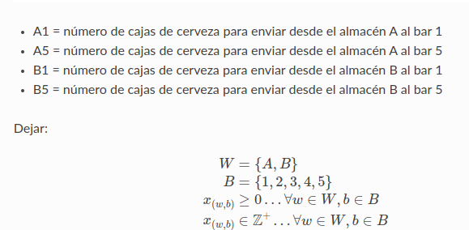

# A PL Problem

El problema de transporte es un problema clásico de programación lineal 
en el cual se debe minimizar el costo del abastecimiento a una serie de puntos de demanda 
a partir de un grupo de puntos de oferta, teniendo en cuenta los distintos precios 
de envío de cada punto de oferta a cada punto de demanda. Por ejemplo, supongamos 
que tenemos que enviar cajas de cervezas de 2 cervecerías a 5 bares de acuerdo al siguiente gráfico:

Asimismo, supongamos que nuestro gerente financiero nos informa que el costo de transporte 
por caja de cada ruta se conforma de acuerdo a la siguiente tabla:

Y por último, las restricciones del problema, van a estar dadas por las capacidades de oferta y demanda de cada cervecería y cada bar, 
las cuales se detallan en el gráfico de más arriba

**Solución**

Enunciado

Formulación función objetivo

Formulación restricciones

