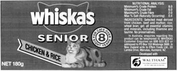
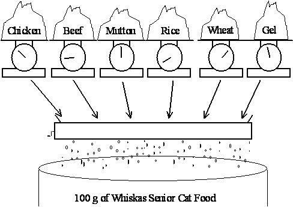

# A Blending Problem

Whiskas cat food, shown above, is manufactured by Uncle Ben’s. Uncle Ben’s want to produce their cat food products as cheaply as possible while ensuring they meet the stated nutritional analysis requirements shown on the cans. Thus they want to vary the quantities of each ingredient used (the main ingredients being chicken, beef, mutton, rice, wheat and gel) while still meeting their nutritional standards.

The costs of the chicken, beef, and mutton are $0.013, $0.008 and $0.010 respectively, while the costs of the rice, wheat and gel are $0.002, $0.005 and $0.001 respectively. (All costs are per gram.) For this exercise we will ignore the vitamin and mineral ingredients. (Any costs for these are likely to be very small anyway.)

Each ingredient contributes to the total weight of protein, fat, fibre and salt in the final product. The contributions (in grams) per gram of ingredient are given in the table below.

Stuff | Protein | Fat | Fibre | Salt
----- | ------- | --- | ----- | ----
Chicken | 0.100  | 0.080  | 0.001  | 0.002
Beef | 0.200 | 0.100 | 0.005  | 0.005
Mutton | 0.150 | 0.110 | 0.003 | 0.007
Rice | 0.000 | 0.010 | 0.100 | 0.002
Wheat bran | 0.040 | 0.010 | 0.150 | 0.008
Gel | 0.000 | 0.000 | 0.000 | 0.000